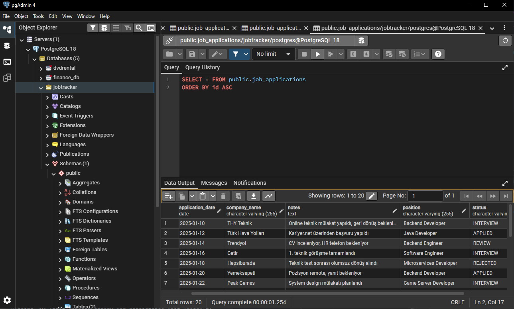
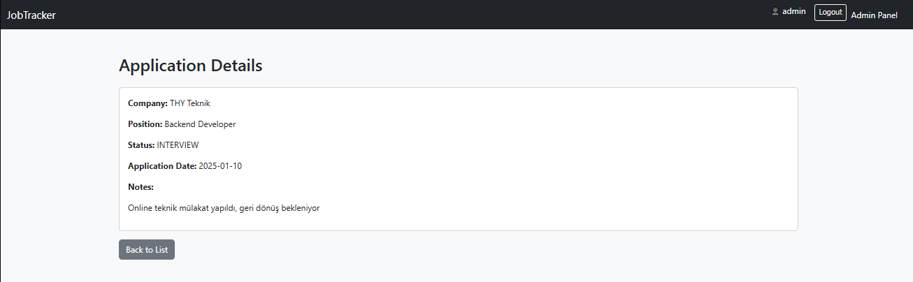
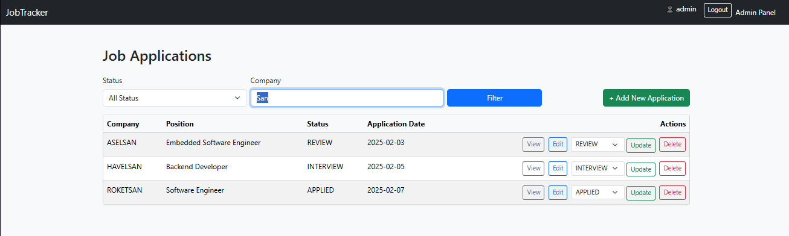
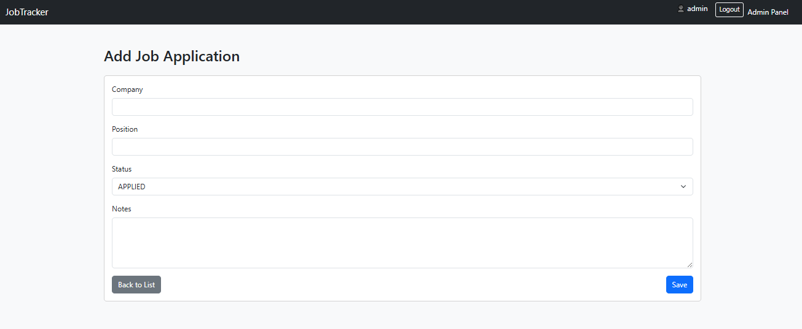

# Job Application Tracker 📋

A web-based application where users can track and manage their job applications, monitor different application stages, and organize their recruitment process efficiently.

- Backend: **Spring Boot + PostgreSQL**
- Frontend: **Thymeleaf (Server-Side Rendering)**
- Architecture: **MVC + REST API**

---

# 📊 Preview

<p align="center">
  
  
  </p>
<p align="center">
  
 
  
   
</p>

  
</p>
<p align="center">
 
  
  
</p>

---

## ✨ Features

- Secure authentication with Spring Security  
- Create, update, delete and manage job applications  
- Application status workflow: **APPLIED, REVIEW, INTERVIEW, REJECTED, OFFER**  
- Filtering by company name and application status  
- Pagination for large data sets  
- REST API for JSON access  
- API documentation and testing with **Swagger UI**  
- Role-based authorization (**USER / ADMIN**)  

---

## 🧰 Tech Stack

**Backend**
- Java 17  
- Spring Boot (Web, Data JPA, Security)  
- PostgreSQL  
- Thymeleaf  
- Maven  

**API Documentation**
- Springdoc OpenAPI (Swagger UI)  

**Tools**
- Git / GitHub  
- PostgreSQL / pgAdmin  
- IntelliJ IDEA  

---

## 🗂 Project Structure

```text
jobtracker/
 ├── src/main/java/com/yigitkagankartal/jobtracker
 │   ├── controller
 │   ├── model
 │   ├── repository
 │   ├── service
 │   ├── config
 │   └── JobtrackerApplication.java
 │
 ├── src/main/resources
 │   ├── templates
 │   ├── static
 │   └── application.properties
 │
 └── pom.xml
```
## 🚀 Getting Started

This project runs with PostgreSQL and Spring Boot.

### Requirements
- JDK 17+
- PostgreSQL
- Maven
- Git

---

### Clone the project

```bash
git clone https://github.com/yigitkagankartal/Job-Tracker.git
cd Job-Tracker
```

---

### PostgreSQL Setup

Create a database:

```sql
CREATE DATABASE jobtracker;
```

Open this file:

```
src/main/resources/application.properties
```

Configure your PostgreSQL connection:

```properties
spring.datasource.url=jdbc:postgresql://localhost:5432/jobtracker
spring.datasource.username=postgres
spring.datasource.password=YOUR_PASSWORD

spring.jpa.hibernate.ddl-auto=update
spring.jpa.show-sql=true
spring.jpa.properties.hibernate.format_sql=true
```

---

### Run the Application

Start the project using:

```bash
mvn spring-boot:run
```

After startup, the application will be available at:

Web UI:  
http://localhost:8080  

Swagger UI:  
http://localhost:8080/swagger-ui.html  

---

### Default Login Credentials

```
Username: admin  
Password: 1234  
Role: ADMIN
```

> The password is stored in the database using BCrypt hashing.

---

### REST API Endpoints

GET    /api/applications  
GET    /api/applications/{id}  
POST   /api/applications  
PUT    /api/applications/{id}  
DELETE /api/applications/{id}  

Example POST request:

```json
{
  "companyName": "Turkish Airlines",
  "position": "Backend Developer",
  "status": "INTERVIEW",
  "applicationDate": "2025-11-20",
  "notes": "Second technical interview scheduled"
}
```

---

### Performance Optimization

To optimize filtering and search performance, the following fields were indexed:

- status  
- company_name  
- application_date  

Indexing strategy was validated using **EXPLAIN ANALYZE** and resulted in significantly faster query execution.

---

### Future Improvements

- Export to CSV / Excel  
- JWT authentication system  
- Analytics and statistics dashboard  
- Docker + Docker Compose setup  
- Multi-user application isolation  

---

# 👤  [Dev](https://github.com/yigitkagankartal) 

